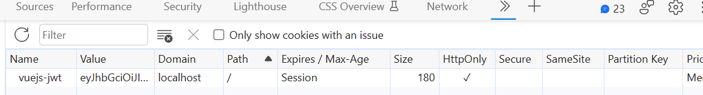

# VueJS 3 Composition API

This stack is using Vue 3 + TypeScript + Vite

## Initial project

initial project with template
```bash
npm init vite -- --template vue-ts vuejs3-composition-api
```

```bash
# install dependencies
cd vuejs3-composition-api
npm install
#run project
npm run dev
```

DateTimes with Luxon : https://moment.github.io/luxon/#/install
```bash
npm i --save-dev @types/luxon
```
The state management solution for Vue.js 3 Errata: Installing Pinia :https://pinia.vuejs.org/
```bash
npm install pinia
```

Express is a minimal and flexible Node.js web application framework : https://expressjs.com/
```bash
npm i --save-dev @types/express
```

CORS is a node.js package for providing a Connect/Express middleware
```bash
npm i --save-dev @types/cors
```

ts-node is TypeScript execution and REPL for node.js : https://typestrong.org/ts-node/
```bash
npm install ts-node
```

if cannot execute and found this error `ERR_UNKNOWN_FILE_EXTENSION` you can remove in package.json

```json
{
    ...
    "type": "module",
}
```
and execute with command

```bash
ts-node --esm .\src\server\index.ts
```

Install Vue Router

```
npm install vue-router
```

Markdown

```bash
npm install marked
npm install marked-highlight
npm install highlight.js
```


`Lodash` A modern JavaScript utility library delivering modularity, performance & extras. https://lodash.com/
```bash
npm install lodash
```
`Body Parser` on backend server for using at `app.use(bodyParser.json())`
```bash
npm install body-parser@1.19 @types/body-parser@1.19 --dev
```

to check syntax and running only file .ts

```bash
npx ts-node-esm src/validation.ts
```

## Auhentication and Authorization

<p align="center">
  
</p>


### Prepare to install dependencies

```bash
npm install cookie-parser@1.4.0 @types/cookie-parser@1.4.0 --include=dev

npm install jsonwebtoken@8.5.1 @types/jsonwebtoken@8.5.1 --include=dev

npm install express-session@1.17.3 @types/express-session@1.17.3 --include=dev
```

### Tooling - Vite Proxy Configuration

Config at `vite.config.ts` to change path by proxy config : https://vitejs.dev/config/server-options.html#server-proxy

```ts
import { defineConfig } from 'vite'
import vue from '@vitejs/plugin-vue'

// https://vitejs.dev/config/
export default defineConfig({
  plugins: [vue()],
  server: {
    proxy: {
      '^/api/.*': {
        target: 'http://localhost:8000',
        changeOrigin: true,
        rewrite: (path) => {
          console.log(path)
          const p = path.replace(/^\/api/, '')
          console.log(p)
          return p
        },
      }
    }
  }
})
```

### Signing a JWT

validaiton and debuging with https://jwt.io/

go to the `src/server/index.ts` and import in below

```ts
...
import express, {Request, Response} from 'express'
import cookieParser from 'cookie-parser';
import jsonwebtoken from 'jsonwebtoken';
...

const app = express()
...
app.use(cookieParser())
...

const SECRET = 'my-secret'
const COOKIE = 'vuejs-jwt'

function authenticate (id: string, req: Request, res:Response) {
    const token = jsonwebtoken.sign({ id }, SECRET, {
        issuer: 'vuejs-corse',
        expiresIn: '30 days'
    })
    res.cookie(COOKIE,token);
}

app.post<{},{},NewUser>("/users", (req,res) => {
    const user: User = {...req.body, id: (Math.random() * 10000).toFixed() }
    allUsers.push(user)
    authenticate(user.id,req,res)
    const { password, ...rest} = user
    res.json({...rest})
})

```

restart server express and try to login

you can see cookie like this

<p align="center">
  
</p>

and go to the  https://jwt.io to debug and then enter verify secret

<p align="center">
  
</p>

to make more secure add  `http only` option

```ts
...
function authenticate (id: string, _: Request, res:Response) {
    ...
    res.cookie(COOKIE,token,{ httpOnly: true });
}
...
```

<p align="center">
  
</p>

### Authenicating Users

on `server/index.ts` add code to verify user jwt token

```ts
//...
app.get("/current-user",(req,res) => {
    try {
        const token = req.cookies[COOKIE]
        const result = jsonwebtoken.verify(token,SECRET) as { id: string }
        console.log(result)
        res.json( { id: result.id })
    } catch (e) {
        //...
        res.status(404).end();
    }
})
//...
```

and then add some code to fetch at `App.vue` to see the result.

```ts
<script>
//...

async function authenticate() {
  const res = await window.fetch("/api/current-user",{
    headers: {
      'Content-Type': 'application/json'
    }
  })

  console.log(await res.json())
}

authenticate()
</script>
```

restart server again, you can see console log result

on network response result.

<p align="center">
  
</p>

<p align="center">
  
</p>

can try to wrong secret by change `SECRET` to `xxxx` code at `index.ts`, and then will be return 404 in block catch

```ts
app.get("/current-user",(req,res) => {
    try {
        const token = req.cookies[COOKIE]
        const result = jsonwebtoken.verify(token,'xxxx') as { id: string }
        console.log(result)
        res.json( { id: result.id })
    } catch (e) {
        //...
        res.status(404).end();
    }
})
```

<p align="center">
  
</p>


